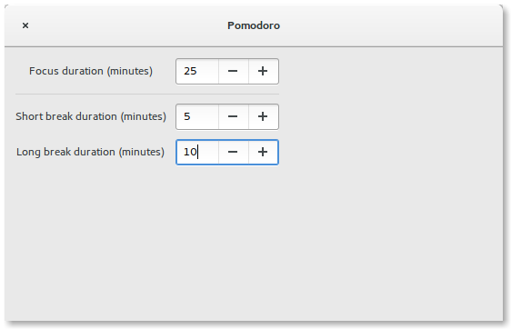

# Gnome-Shell Pomodoro extension

[](https://travis-ci.org/lcallarec/gnome-shell-pomodoro)

* Tested on gnome-shell 3.16 and 3.18.
* Not proposed as official gnome-shell extension yet : it's not completly finished

## Features




* Start, pause & restart the timer. Keep it simple !
* Bells and tray messages
* Configure cycle times

## Install instructions

```bash
#Clone the project
git clone https://github.com/lcallarec/gnome-shell-pomodoro.git

#Build and Install
cd gnome-shell-pomodoro
make && make install #Install in ~/.local/share

#Enable the extension programmatically
make enable
```

Then restart gnome-shell by typing `Alt+F2` and `r` in the prompt
